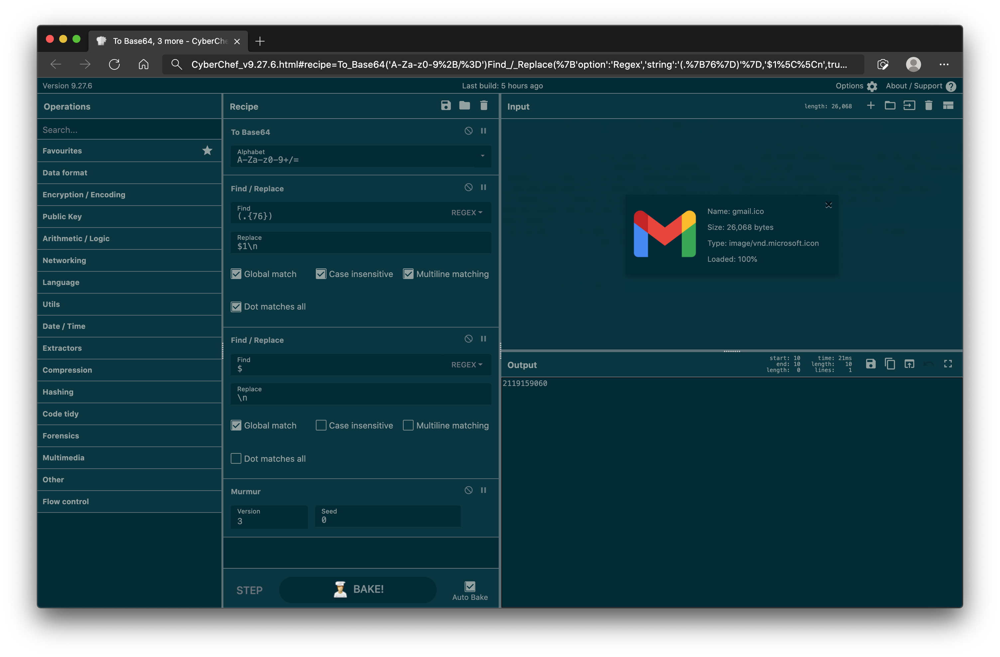

# CyberChef with Murmur Support





## Usage
Murmur support was primarily developed to facilitate threat hunting via Shodan. As such, the Murmur operation only returns a 32-bit signed hash, which can be used to perform Shodan queries using the `http.html_hash` and `http.favicon.hash` facets.

### Shodan - `http.html_hash`
> For web servers, the crawlers also calculate a numeric hash of the website. To find identical websites there's the `http.html_hash` property, search filter and facet. `http.html_hash` is a numeric hash of the HTML for the website (as stored in the `http.html` property).

Simply paste in the expected HTML / response into the CyberChef Input area. Use the Murmur operation, setting the version as `3`, and the Seed value to `0`. The value returned in the Output can be used to perform a `http.html_hash` query.


### Shodan - `http.favicon.hash`
Generating a Shodan-compliant hash requires a few additional steps:

1. Loading a favicon into the Input area
2. Converting the input to Base64
3. Inserting a newline `\n`, every 76 characters
4. Adding a final newline `\n` at the very end of the output
5. Processing the output through the Murmur operation

Alternatively, the following recipe can be loaded into CyberChef using the `Load Recipe` button in the Recipe area:

```
To_Base64('A-Za-z0-9+/=')
Find_/_Replace({'option':'Regex','string':'(.{76})'},'$1\\n',true,true,true,true)
Find_/_Replace({'option':'Regex','string':'$'},'\\n',true,false,false,false)
Murmur('3',0)
```

The resulting output can then be used with the `http.favicon.hash` facet.

---

## Installation
Whilst a compiled version of CyberChef with Murmur support is available on the [Releases](https://github.com/ssnkhan/CyberChef/releases) page, it is highly advisable that users compile the tool using the Master branch of CyberChef.

1. `git clone https://github.com/gchq/CyberChef.git`
2. Follow the installation instructions on the [CyberChef Wiki](https://github.com/gchq/CyberChef/wiki/Getting-started#installing)
3. Update `/src/core/config/Categories.json` to include an entry for `Murmur` under `Hashing`
4. Copy [Murmur.mjs](./Murmur.mjs) to `/src/core/operations`
5. Copy [murmurhash.js](./murmurhash.js) to `/src/core/vendor`
6. Follow the remaining instructions on the [CyberChef Wiki](https://github.com/gchq/CyberChef/wiki/Getting-started#compiling) to compile CyberChef with native Murmur support (use of `--force` may be necessary)

---

## Further Reading
* [Scan't Touch This - Proactively Detect Adversaries Beyond Your Environment](https://github.com/aaronst/talks/blob/master/scanttouchthis.pdf)
* [Pivoting with Property Hashes](https://help.shodan.io/mastery/property-hashes)
* [Weaponizing favicon.ico for BugBounties , OSINT and what not](https://medium.com/@Asm0d3us/weaponizing-favicon-ico-for-bugbounties-osint-and-what-not-ace3c214e139)
* [Shodan Favicon Hashes](https://github.com/sansatart/scrapts/blob/master/shodan-favicon-hashes.csv)

---

## Acknowledgements
This version of Murmur hash support within CyberChef is based on [Gary Court's](https://github.com/garycourt/murmurhash-js) implementation, subsequently ported for [node-js](https://github.com/perezd/node-murmurhash). 

Due to conflicting licensing terms, it is not possible to submit pull requests to the CyberChef Master branch without re-implementing the Murmur hash implementation.


---

## License
License (MIT)

Copyright (c) 2020 Gary Court, Derek Perez

Permission is hereby granted, free of charge, to any person obtaining a copy of this software and associated documentation files (the "Software"), to deal in the Software without restriction, including without limitation the rights to use, copy, modify, merge, publish, distribute, sublicense, and/or sell copies of the Software, and to permit persons to whom the Software is furnished to do so, subject to the following conditions:

The above copyright notice and this permission notice shall be included in all copies or substantial portions of the Software.

THE SOFTWARE IS PROVIDED "AS IS", WITHOUT WARRANTY OF ANY KIND, EXPRESS OR IMPLIED, INCLUDING BUT NOT LIMITED TO THE WARRANTIES OF MERCHANTABILITY, FITNESS FOR A PARTICULAR PURPOSE AND NONINFRINGEMENT. IN NO EVENT SHALL THE AUTHORS OR COPYRIGHT HOLDERS BE LIABLE FOR ANY CLAIM, DAMAGES OR OTHER LIABILITY, WHETHER IN AN ACTION OF CONTRACT, TORT OR OTHERWISE, ARISING FROM, OUT OF OR IN CONNECTION WITH THE SOFTWARE OR THE USE OR OTHER DEALINGS IN THE SOFTWARE.
